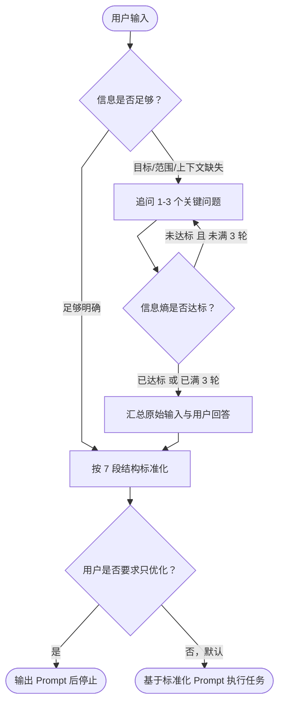

<div align="center">

# Universal Prompt Optimizer

**让 AI Agent 先把需求问清楚，再把模糊指令改写成可执行 Prompt。**

<p>
  
  
  
  
  
</p>

**模糊指令 → 追问澄清 → 结构化 Prompt → 默认执行**

适用于 Claude Code / Codex / Cursor / Copilot 等支持 Agent Skills / `SKILL.md` 工作流的 AI Coding Agent。

---

## 它解决了什么痛点？

很多 AI Agent 任务失败，并不是因为模型不会做，而是因为**一开始的用户指令太模糊**。

例如：

> 帮我修一下 bug  
> 帮我优化这个页面  
> 帮我重构一下  
> 帮我写个文档  
> 这个项目怎么做？

普通 Agent 往往会直接猜测用户意图，然后开始改代码、写文档或设计方案。猜对了是运气，猜错了就会带来以下问题：

| 常见问题 | 后果 |
|---|---|
| 缺少复现步骤就开始 Debug | 改错方向，甚至引入新问题 |
| 不知道范围就开始重构 | 小修变大改，影响不可控 |
| 没有确认安全边界 | 可能误删文件、修改生产配置或扩大操作范围 |
| Prompt 口语化、不稳定 | 不同 Agent 执行结果差异很大 |
| 一次性追问太多 | 用户懒得回答，交互体验变差 |

**Universal Prompt Optimizer** 在 Agent 执行任务前增加一个轻量的“需求澄清层”：

1. 判断当前信息是否足够执行；
2. 信息不足时，只追问 1～3 个关键问题；
3. 信息熵达标后立即停止追问；
4. 将用户原话和补充信息整理成标准化 Prompt；
5. 默认继续执行任务，避免多余确认打断流程。

---

## 核心亮点

| 能力 | 说明 |
|---|---|
| **主动追问，而不是直接猜** | 缺少目标、范围、报错、复现步骤、安全边界时，先问清楚再动手。 |
| **信息熵止步** | 不追求“把所有细节问完”，只要足以决定执行方向，就停止追问。 |
| **最多 3 轮追问** | 防止需求澄清变成审问，兼顾准确性和用户体验。 |
| **7 段式 Prompt 标准化** | 固定输出为：角色 / 任务 / 背景 / 目标 / 约束 / 步骤 / 输出格式。 |
| **默认优化后执行** | 用户没说“只优化不执行”时，标准化后直接进入任务执行。 |
| **安全护栏前置** | 对删除数据、生产配置、批量修改等高风险任务，强制暴露风险和人工确认点。 |
| **零配置、无 API Key** | 纯 `SKILL.md` 工作流，不依赖外部服务，不需要额外模型接口。 |
| **中文口语化指令友好** | 针对“帮我看看”“优化一下”“处理一下”“规划一下”等中文模糊需求做了触发优化。 |

---

## 工作流程



---

## 一分钟示例

### 输入：模糊指令

```text
帮我修一下登录功能，用户说有时候登录不了
```

### Skill 先追问

```markdown
在继续之前需要确认几个信息，回答越具体，优化结果越精确（不清楚的可以答“不确定”）：

1. 具体异常表现是什么：报错、白屏、点击没反应、自动退出，还是请求失败？
2. 是所有用户都会遇到，还是部分用户/部分环境才会出现？
3. 最近是否改动过登录、Token、权限或网关相关逻辑？
```

### 用户补充

```text
所有用户都有概率遇到，点击登录没反应，无报错。最近改过 Token 刷新逻辑。
```

### Skill 标准化为可执行 Prompt

```markdown
## 角色
你是一个前端调试专家，擅长排查浏览器端异步逻辑、Token 刷新流程和网络请求问题。

## 任务
排查并修复登录按钮点击后无响应的问题。

## 背景
所有用户均有概率遇到该问题，表现为点击登录按钮后页面无反应、无报错提示。最近改动过 Token 刷新逻辑，疑似相关。

## 目标
定位登录按钮无响应的根因并完成最小修复，确保用户点击登录后可以正常发起登录请求，并且 Token 刷新流程不被破坏。

## 约束
- 不得重构整个认证模块，只修复导致登录无响应的具体问题
- 不得修改后端登录接口逻辑，优先排查前端事件绑定、异常吞掉、异步 return 和 Token 刷新竞态
- 修改前先查看最近与 Token 刷新相关的 diff

## 步骤
1. 定位登录按钮点击事件绑定代码，确认事件是否正常触发
2. 检查 Token 刷新逻辑是否存在未捕获异常、提前 return 或状态锁未释放
3. 使用 Network/Console 验证点击登录后请求是否发出，以及是否有静默错误
4. 确认根因后做最小修复，并验证登录流程和 Token 刷新流程互不干扰

## 输出格式
请输出：问题根因、修复方式、涉及文件、关键代码变更、验证步骤。
```

---

## 适用场景

| 场景 | 典型输入 | Skill 会重点澄清 |
|---|---|---|
| Bug 排查 | “帮我看看这个报错” | 报错信息、复现步骤、影响范围、最近改动 |
| 功能开发 | “帮我加个搜索功能” | 功能目标、页面/模块、技术栈、交互细节 |
| 代码重构 | “这块代码太乱了，优化一下” | 重构范围、是否保持接口不变、是否已有测试 |
| 单元测试 | “补一下测试” | 测试对象、测试框架、覆盖目标、边界情况 |
| 文档写作 | “帮我写个 README” | 读者对象、项目定位、安装方式、亮点和示例 |
| 技术方案 | “这个项目怎么做” | 当前阶段、目标、约束、MVP、风险点 |
| 学习/研究 | “帮我研究一下这个东西” | 研究问题、信息范围、是否需要联网、引用格式 |
| 内容润色 | “帮我改得正式一点” | 目标读者、语气、长度、是否保留原意 |

---

## 什么时候不会触发？

当用户已经给出足够明确的信息时，本 Skill 不会强行追问。

例如：

```text
请把 src/auth/token.ts 第 35 行的 timeout 从 3000 改成 5000，并补充一个单元测试。
```

这类任务目标、文件路径、操作和验证方式都很明确，Agent 可以直接执行。

---

## 安装

### 方式一：项目级安装

适合只想让当前仓库使用该 Skill 的场景。

```bash
mkdir -p .claude/skills/universal-prompt-optimizer
cp SKILL.md .claude/skills/universal-prompt-optimizer/SKILL.md
```

### 方式二：用户级安装

适合希望所有项目都能使用该 Skill 的场景。

```bash
mkdir -p ~/.claude/skills/universal-prompt-optimizer
cp SKILL.md ~/.claude/skills/universal-prompt-optimizer/SKILL.md
```

### 方式三：适配其他 Agent Skills 工具

如果你的工具支持 Agent Skills / `SKILL.md` 规范，可以将 `SKILL.md` 放到对应目录中。

| 工具 | 项目级目录 | 用户级目录 |
|---|---|---|
| Claude Code | `.claude/skills/` | `~/.claude/skills/` |
| GitHub Copilot | `.github/skills/` / `.claude/skills/` / `.agents/skills/` | `~/.copilot/skills/` / `~/.agents/skills/` |
| Codex / 兼容 Agent | `.agents/skills/` | `~/.agents/skills/` |
| Cursor / Windsurf / Gemini CLI | 以各自 Skills 目录规范为准 | 以各自 Skills 目录规范为准 |

> 建议每个 Skill 单独一个目录，并将文件命名为 `SKILL.md`。

---

## 推荐仓库结构

```text
universal-prompt-optimizer/
├── SKILL.md          # Skill 主体：触发条件、追问规则、标准化规则、执行流程
├── README.md         # 项目说明、安装方式、示例和贡献指南
├── LICENSE           # MIT License
└── examples/         # 可选：更多 Before / After 示例
```

---

## 使用方式

安装后，直接用自然语言向 Agent 提需求即可。

```text
帮我优化这个页面
```

```text
帮我把这个接口文档整理一下
```

```text
帮我重构一下支付模块，代码有点乱
```

```text
先帮我把这个需求优化成适合 Claude Code 执行的 prompt，不要执行
```

如果任务模糊，Skill 会先追问；如果任务足够明确，Skill 会直接标准化并执行。

---

## 输出格式

默认输出包含三部分：

```markdown
## 追问汇总
- 问：...
- 答：...

## 标准化 Prompt
## 角色
...

## 任务
...

## 背景
...

## 目标
...

## 约束
...

## 步骤
...

## 输出格式
...

## 未确认信息
- ...
```

如果用户明确要求“只输出 Prompt”“不要解释”，则会进入极简模式，只输出标准化后的 Prompt 正文。

---

## 设计原则

### 1. 不改变用户原意

“帮我看看登录 bug”不会被扩写成“重构整个认证系统”。

### 2. 不编造上下文

缺少文件名、接口名、错误日志、业务规则时，优先追问，而不是自行脑补。

### 3. 不无限追问

每轮最多 1～3 个问题，最多追问 3 轮；一旦足以确定执行方向，就立即停止。

### 4. 不过度工程化

简单任务保持轻量，不把小任务扩展成复杂流程。

### 5. 不跳过安全边界

涉及删除、覆盖、生产环境、批量操作时，必须暴露风险并设置人工确认步骤。

---

## 和普通 Prompt 模板有什么不同？

| 对比项 | 普通 Prompt 模板 | Universal Prompt Optimizer |
|---|---|---|
| 输入方式 | 用户必须自己填完整模板 | 支持自然语言模糊输入 |
| 缺信息处理 | 往往直接猜 | 先追问关键缺失项 |
| 追问控制 | 容易问太多或问不准 | 信息熵达标即停，最多 3 轮 |
| 输出结构 | 依赖用户写法 | 固定 7 段标准结构 |
| 执行体验 | 优化和执行容易割裂 | 默认优化后直接执行 |
| 安全边界 | 需要用户自己补充 | 内置高风险操作确认规则 |

---

## FAQ

### 这个 Skill 需要 API Key 吗？

不需要。当前版本是纯 `SKILL.md` 模式，不依赖额外模型、后端服务或第三方 API。

### 它会不会每次都追问？

不会。只有任务目标、范围、上下文、安全边界等关键信息不足时才追问。任务已经具体时，会直接进入标准化或执行。

### 为什么不是一次性问很多问题？

因为一次性问太多会降低用户回答意愿。本 Skill 每轮只问 1～3 个最关键问题，并在信息足够时立即停止。

### 为什么标准化后默认执行？

多数用户说“帮我修 / 写 / 改 / 做”时，真正目标是完成任务，而不是只得到一个优化后的 Prompt。默认执行可以减少一次无意义确认。用户明确说“只优化不执行”时，Skill 会停止在 Prompt 输出阶段。

### 能不能接入小模型自动改写？

当前基础版不接入小模型，保证零配置和可移植性。后续可以扩展为 `Hook + 小模型` 模式，让用户自行提供模型 API，用于更复杂的自动改写、评分和多版本 Prompt 生成。

---

## Roadmap

- [ ] 增加更多 Before / After 示例
- [ ] 提供英文版 README
- [ ] 增加 `examples/` 示例库，覆盖 Debug、重构、测试、文档、研究等场景
- [ ] 提供可选的 Hook 扩展方案
- [ ] 支持小模型评分与多版本 Prompt 自动改写
- [ ] 增加 Skill 自检清单，帮助用户判断触发条件是否过宽或过窄

---

## GitHub 仓库建议

### Repository description

```text
Turn vague AI Agent requests into clarified, structured, executable prompts — zero API key, pure SKILL.md workflow.
```

### Topics

```text
prompt-engineering, claude-code, agent-skills, skill-md, ai-agent, codex, cursor, prompt-optimizer, developer-tools
```

---

## 贡献

欢迎提交 Issue 或 PR，尤其是以下方向：

- 新增真实使用场景示例
- 优化中文口语化触发词
- 补充英文版本
- 改进高风险操作安全边界
- 适配更多 Agent Skills 工具目录

---

## License

MIT License

