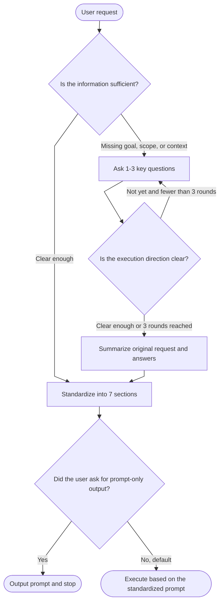

<div align="center">

# Universal Prompt Optimizer

**Make AI Agents clarify requirements first, then rewrite vague requests into executable prompts.**

<p>
  
  
  
  
  
</p>

**Vague request → Clarifying questions → Structured prompt → Execute by default**

Designed for Claude Code, Codex, Cursor, Copilot, and other AI coding agents that support Agent Skills or `SKILL.md`-style workflows.

</div>

---

## What problem does it solve?

Many AI Agent tasks fail not because the model is incapable, but because the original user request is too vague.

For example:

> Fix this bug  
> Optimize this page  
> Refactor this module  
> Write a document for me  
> How should I build this project?

A typical agent may immediately guess the user's intent and start editing code, writing documents, or designing a solution. When the guess is right, it works. When the guess is wrong, it can create serious problems:

| Common issue | Result |
|---|---|
| Debugging starts without reproduction steps | The agent fixes the wrong problem or introduces new bugs |
| Refactoring starts without scope | A small change turns into a risky rewrite |
| Safety boundaries are not confirmed | Files may be deleted, production configs changed, or scope expanded unexpectedly |
| The prompt is casual and unstable | Different agents produce very different results |
| Too many questions are asked at once | The user gives up or provides incomplete answers |

**Universal Prompt Optimizer** adds a lightweight requirement-clarification layer before the agent executes the task:

1. Check whether the current information is enough to proceed.
2. If not, ask only 1–3 high-impact questions.
3. Stop asking once the execution direction is clear.
4. Rewrite the original request and user answers into a standardized prompt.
5. Continue execution by default, unless the user explicitly asks for prompt optimization only.

---

## Key features

| Feature | Description |
|---|---|
| **Clarify before guessing** | When goals, scope, errors, reproduction steps, or safety boundaries are missing, the agent asks first. |
| **Entropy-based stopping** | It does not try to collect every possible detail. Once the execution direction is clear, it stops asking. |
| **Maximum 3 clarification rounds** | Prevents requirement clarification from turning into an interrogation. |
| **7-section prompt standardization** | Rewrites requests into: Role / Task / Context / Goal / Constraints / Steps / Output Format. |
| **Execute by default** | Unless the user says “optimize only” or “do not execute,” the agent proceeds after standardization. |
| **Built-in safety guardrails** | High-risk actions such as deleting data, editing production config, or batch operations must expose risks and require confirmation points. |
| **Zero config, no API key** | Pure `SKILL.md` workflow. No external services, no backend, no additional model API. |
| **Friendly to casual natural-language requests** | Optimized for vague requests such as “take a look,” “optimize this,” “fix it,” “plan it,” or “make it better.” |

---

## How it works



---

## One-minute example

### Input: vague request

```text
Fix the login feature. Users say they sometimes cannot log in.
```

### The skill asks clarifying questions first

```markdown
Before continuing, I need to confirm a few details. The more specific your answers are, the better the optimized prompt will be. If you are unsure, you can answer "not sure".

1. What exactly happens: error message, blank page, no response after clicking, automatic logout, or request failure?
2. Does it affect all users, or only certain users/environments?
3. Have there been recent changes to login, token refresh, permissions, or gateway logic?
```

### User answer

```text
It may happen to all users. Clicking the login button does nothing, and there is no error message. We recently changed the token refresh logic.
```

### The skill rewrites it into an executable prompt

```markdown
## Role
You are a frontend debugging expert specializing in browser-side async logic, token refresh flows, and network request issues.

## Task
Investigate and fix the issue where clicking the login button produces no response.

## Context
The issue may affect all users. After clicking the login button, the page does not respond and no error message is shown. The token refresh logic was recently changed and may be related.

## Goal
Identify the root cause of the unresponsive login button and implement a minimal fix. After the fix, users should be able to trigger the login request normally, and the token refresh flow should remain intact.

## Constraints
- Do not refactor the entire authentication module; only fix the specific cause of the login issue.
- Do not modify the backend login API. Prioritize frontend event binding, swallowed exceptions, async return paths, and token-refresh race conditions.
- Review the recent diff related to token refresh before making changes.

## Steps
1. Locate the login button click handler and verify that the event is triggered correctly.
2. Check whether the token refresh logic contains uncaught exceptions, early returns, or unreleased state locks.
3. Use Network and Console to verify whether the login request is sent and whether silent errors occur.
4. After identifying the root cause, apply a minimal fix and verify that login and token refresh flows do not break each other.

## Output Format
Provide the root cause, fix approach, affected files, key code changes, and verification steps.
```

---

## Use cases

| Scenario | Typical input | What the skill clarifies |
|---|---|---|
| Bug investigation | “Help me check this error” | Error message, reproduction steps, impact scope, recent changes |
| Feature development | “Add a search feature” | Feature goal, page/module, tech stack, interaction details |
| Code refactoring | “This code is messy. Optimize it” | Refactor scope, whether APIs must remain unchanged, existing tests |
| Unit testing | “Add tests for this” | Test target, test framework, coverage goal, edge cases |
| Documentation | “Write a README” | Target audience, project positioning, installation, highlights, examples |
| Technical planning | “How should I build this project?” | Current stage, target, constraints, MVP, risks |
| Research | “Research this topic for me” | Research question, information scope, whether web search is needed, citation style |
| Writing and editing | “Make this more formal” | Audience, tone, length, whether the original meaning must be preserved |

---

## When it will not trigger

If the user already provides enough specific information, the skill does not force extra clarification.

For example:

```text
Please change the timeout in src/auth/token.ts line 35 from 3000 to 5000 and add a unit test.
```

This task already has a clear target, file path, operation, and verification requirement, so the agent can proceed directly.

---

## Installation

### Option 1: Project-level installation

Use this when you only want the skill to apply to the current repository.

```bash
mkdir -p .claude/skills/universal-prompt-optimizer
cp SKILL.md .claude/skills/universal-prompt-optimizer/SKILL.md
```

### Option 2: User-level installation

Use this when you want the skill to be available across all projects.

```bash
mkdir -p ~/.claude/skills/universal-prompt-optimizer
cp SKILL.md ~/.claude/skills/universal-prompt-optimizer/SKILL.md
```

### Option 3: Other Agent Skills-compatible tools

If your tool supports Agent Skills or a `SKILL.md` convention, place `SKILL.md` in the corresponding skills directory.

| Tool | Project-level directory | User-level directory |
|---|---|---|
| Claude Code | `.claude/skills/` | `~/.claude/skills/` |
| GitHub Copilot | `.github/skills/` / `.claude/skills/` / `.agents/skills/` | `~/.copilot/skills/` / `~/.agents/skills/` |
| Codex / compatible agents | `.agents/skills/` | `~/.agents/skills/` |
| Cursor / Windsurf / Gemini CLI | Follow each tool's Skills directory convention | Follow each tool's Skills directory convention |

> Recommended: place each skill in its own folder and name the file `SKILL.md`.

---

## Recommended repository structure

```text
universal-prompt-optimizer/
├── SKILL.md          # Skill definition: triggers, clarification rules, standardization, execution flow
├── README.md         # Project overview, installation, examples, and contribution guide
├── LICENSE           # MIT License
└── examples/         # Optional: more Before / After examples
```

---

## Usage

After installation, just describe your task to the agent in natural language.

```text
Optimize this page.
```

```text
Clean up this API document.
```

```text
Refactor the payment module. The code is getting messy.
```

```text
First rewrite this requirement into a prompt suitable for Claude Code. Do not execute it.
```

If the task is vague, the skill asks clarifying questions first. If the task is already clear, it standardizes and executes directly.

---

## Output format

By default, the output contains three parts:

```markdown
## Clarification Summary
- Question: ...
- Answer: ...

## Standardized Prompt
## Role
...

## Task
...

## Context
...

## Goal
...

## Constraints
...

## Steps
...

## Output Format
...

## Unconfirmed Information
- ...
```

If the user explicitly asks to “only output the prompt” or “no explanation,” the skill enters minimal mode and outputs only the standardized prompt body.

---

## Design principles

### 1. Preserve the user's intent

“Take a look at the login bug” should not become “refactor the entire authentication system.”

### 2. Do not invent context

When file names, API names, error logs, or business rules are missing, the skill asks instead of hallucinating them.

### 3. Do not over-clarify

Each round asks at most 1–3 questions. The skill asks no more than 3 rounds in total and stops as soon as the execution direction is clear.

### 4. Do not over-engineer simple tasks

Small tasks should stay lightweight. The skill should not expand them into complex workflows.

### 5. Do not skip safety boundaries

For deletion, overwrite, production environment changes, or batch operations, the skill must expose risks and include human confirmation steps.

---

## How is this different from a normal prompt template?

| Comparison | Normal prompt template | Universal Prompt Optimizer |
|---|---|---|
| Input style | User must fill a complete template | Supports vague natural-language input |
| Missing information | Often guessed by the agent | Clarifies key missing details first |
| Clarification control | May ask too much or ask the wrong questions | Stops when the direction is clear, max 3 rounds |
| Output structure | Depends on how the user writes | Fixed 7-section structure |
| Execution experience | Optimization and execution may feel disconnected | Executes by default after standardization |
| Safety boundaries | Must be provided by the user | Built-in confirmation rules for high-risk actions |

---

## FAQ

### Does this skill require an API key?

No. The current version is a pure `SKILL.md` workflow. It does not require an additional model, backend service, or third-party API.

### Will it ask questions every time?

No. It only asks when key information such as goal, scope, context, or safety boundary is missing. If the task is specific enough, it proceeds directly to standardization or execution.

### Why not ask many questions at once?

Because too many questions reduce the chance of getting useful answers. The skill asks only 1–3 of the most important questions per round and stops once the information is sufficient.

### Why does it execute by default after standardization?

When users say “fix,” “write,” “change,” or “build,” they usually want the task completed, not just a polished prompt. Executing by default removes one unnecessary confirmation step. If the user says “optimize only” or “do not execute,” the skill stops after outputting the prompt.

### Can it use a small model for automatic rewriting?

The base version does not use a small model, which keeps it zero-config and portable. A future `Hook + small model` mode can allow users to provide their own model API for advanced rewriting, scoring, and multi-version prompt generation.

---

## Contributing

Issues and pull requests are welcome, especially for:

- Real-world usage examples
- Better trigger phrases for casual natural-language requests
- English, Chinese, and multilingual documentation
- Improved safety boundaries for high-risk actions
- Compatibility notes for more Agent Skills tools

---

## License

MIT License
